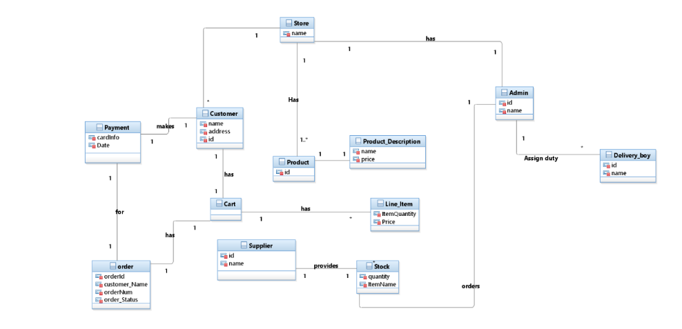
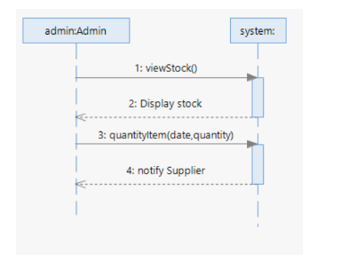
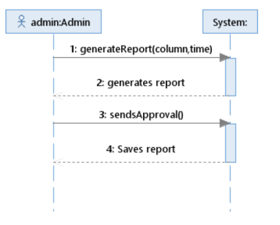
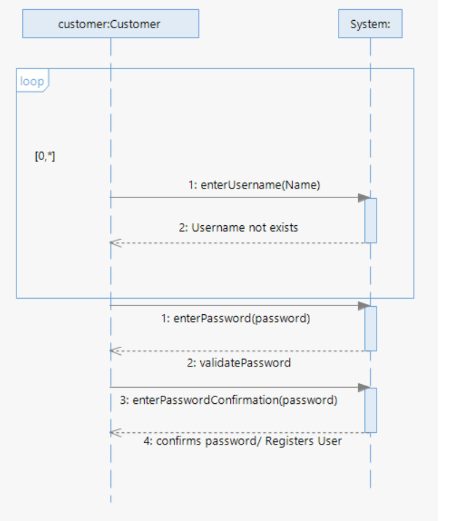
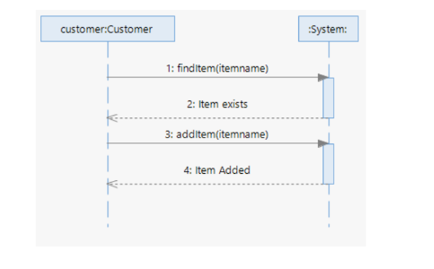
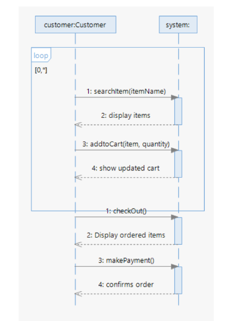
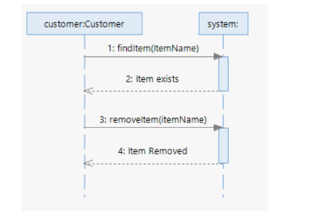
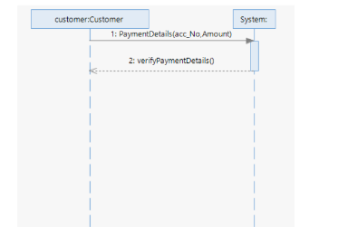
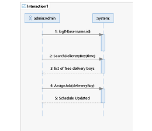
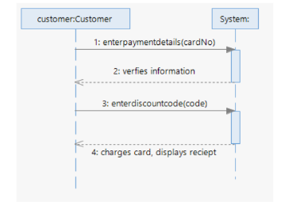

# ClothingStore_DomainModel_SystemSequenceDiagrams

## Contributors
- Maria Saeed Ahmed 😊
- Areeba Sattar 😊

## Course
 Software Design and Analysis

## Domain Model

  

## Sequence Diagrams

1. **Use Case: Order Stock** 🛒

   Description: This use case involves ordering stock items for inventory management.
   
   

2. **Use Case: Generate Sales Report** 📊

   Description: This use case involves generating a sales report for analysis and decision-making.
   
   

3. **Use Case: Register User** 📝

   Description: This use case involves registering a new user in the system.
   
   

4. **Use Case: Add to Wish List** 🌟

   Description: This use case allows users to add items to their wish list for future reference.
   
   

5. **Use Case: Place Order** 🛍️

   Description: This use case enables users to place an order for products or services.
   
   

6. **Use Case: Remove Item from Wish List** ❌

   Description: This use case allows users to remove items from their wish list.
   
   

7. **Use Case: Verify Card Information** 🔍💳

   Description: This use case involves verifying card information for payment processing.
   
   

8. **Use Case: Assign Job to Delivery Boy** 🚚

   Description: This use case involves assigning a delivery job to a delivery personnel.
   
   

9. **Use Case: Make Payment** 💰

   Description: This use case allows users to make payments for their orders.
   
   
